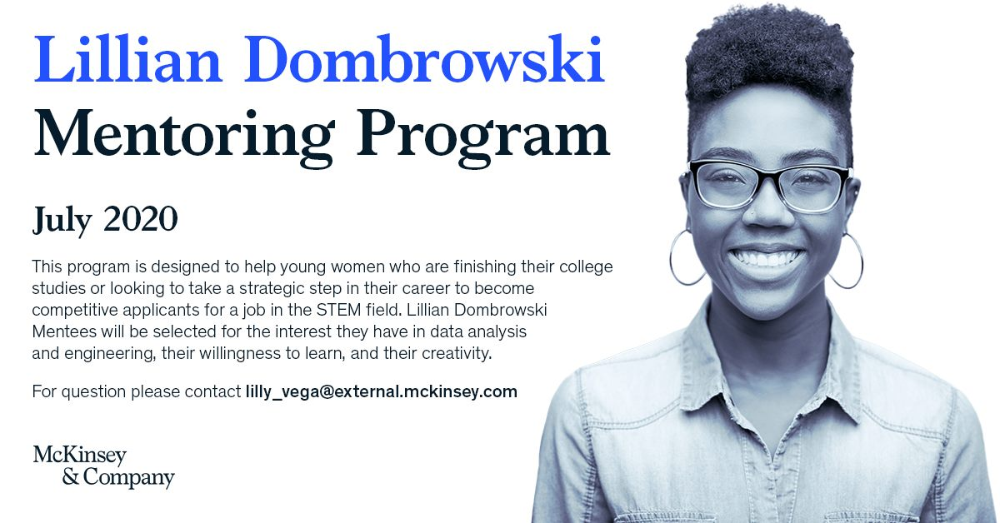
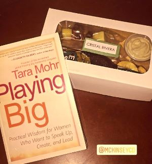

---
authors:
- admin
#- 吳恩達
categories:
- English
#date: "2016-04-20T00:00:00Z"
#draft: false
#featured: false
image:
  caption: 'Image credit: [**TINK**](https://www.tinkoutsidethebox.com/)'
  focal_point: ""
  placement: 2
  preview_only: false
lastmod: "2020-12-01T00:00:00Z"
projects: []
subtitle: '[From McKinsey & Company](https://www.mckinsey.com/) :rocket:'
#summary: Create a beautifully simple website in under 10 minutes.
#tags:
#- Academic
#- 开源
title: 'My experience in “Lillian Dombrowski Mentoring Program”'

---

I believe that been able to have the opportunity to go to school and college is a blessing. Learning new things opens our minds, makes us know more about ourselves, breaks barriers, and opens new opportunities. Companies that worries for the professional development and sharing knowledge should always be value. The first time I went to McKinsey & Company was in July 2019 for [“Data Analytics: Understanding Excel, Alteryx and Tableau”](https://www.facebook.com/McKinseySJO/photos/a.1844467315789421/2440575199511960/)– it was one of my first networking activities.

From that day on I would be aware of any activity they will carry out. In July of 2020, they created a program name [“Lillian Dombrowski Mentoring Program”](https://www.facebook.com/McKinseySJO/photos/a.1844467315789421/2758334964402647/). The goal of it was to bring more women to STEM. I didn't hesitate to participate, I sent my resume and write an essay answering the question: **In what specific way do you want your career in STEM to make life better for others?**

Then I received the email in which I was accepted. I was truly happy about it. Through my experience as engineer I saw how the presence of men in STEM was very strong. In all my meetings I was the only woman and just men were the one who participates most of the time. But I also met some women who supported me and were inspiration for me, so I wanted to support other girls, who were going through the same experiences as me. This was a great opportunity to get started and I had high expectations.

<blockquote> "Find a group of people who challenge and inspire you, spend a lot of time with them and it will change your life."

-Amy Poehler
</blockquote>

For 8 weeks we had group tech sessions that help us to develop different problem-solving skills and learn about tools like Alteryx, Tableau and Python. The experts first explained us theoretically and then put into practice what we learned. They really knew how to use that tools, they gave us tips and were open to answer any question and comments. 

The most astounding part about the program was the 1:1 session with a mentor. Throughout the 8 weeks, we were accompanied by a regular member of the McKinsey firm who supported us in the learning process. My meetings with my mentor were usually on Fridays and I looked forward to that day. It was supposed to last an hour, but sometimes it would be longer than that, we talked about our personal and professional experiences. I think I really knew someone special in my life, I learned a lot about her personal development. 

This program made me think:
-	 How one decision can impact many lives, thanks [Nathalia](https://www.linkedin.com/in/natalia-ram%C3%ADrez-vega/) and all the team that worked together to make this program come true.
-	When something is made with love and passion everything is worth it. 
-	Be genuine, confident, humble, trustworthy, positive and fun to build good relationships. 
-	Women empowering women undoubtedly is powerful.

Oh, I almost forgot… for the closing session they brought us some food and gave us a book. Wow I just love it so much that I can continue talking about it 😊 

So, I will end with this:  if you can be part of this program don’t doubt to get into it. I feel grateful to have this opportunity. I hope to continue participating in more of these amazing initiatives.

*“There is no power for change greater than a community discovering what it cares about.”  -  Margaret J. Wheatley*

