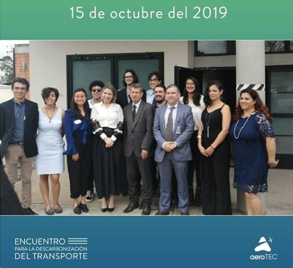

---
authors:
- admin
#- 吳恩達
categories:
- English
#date: "2016-04-20T00:00:00Z"
#draft: false
#featured: false
image:
  caption: 'Image credit: [**Renn Quin**](https://www.behance.net/gallery/67398147/WALKING-GIRLS)'
  focal_point: ""
  placement: 2
  preview_only: false
lastmod: "2020-11-06T00:00:00Z"
projects: []
subtitle: 'If it is not now, then when? :rocket:'
#summary: Create a beautifully simple website in under 10 minutes.
#tags:
#- Academic
#- 开源
title: 'My Journey in Data Science'

---

If you had asked me 5 years ago what data science was or if I would see myself in this field, I would totally said No. College is a time in which you learn and enjoy, even of the pressure of it.  I had good grades, always asked questions to my teachers, and went to extra classes to be always prepared for every test and project at [**TEC**](https://www.tec.ac.cr/). But I knew something was missing: **Getting out of my comfort zone.**  

One year before I had to do my final graduation project, I realized that I wanted to do something different. It wasn´t enough for me to go to a company and do a project that I wouldn´t like. Instead I wanted to make a project that can have 
a positive impact to my country.  I had no idea what my project would be about, I just thought to myself: “Do something with your career that could have a positive impact in Costa Rica” (what I didn’t realize was that for that change of mindset and decision I was changing my whole career path).

I've always been interested in airplanes-yes- airplanes. A friend told me about an electric aircraft research project. I didn't know what it was about and why they would need me. But when I went to the first meeting, I liked the project, the people, and my lead teacher was awesome, I learn so much about her.  So, I got involved. I was the only one of industrial production engineer, but it was fine for me, I wanted something different, right? Well, this experience changed everything, we began to shape the project, going to many places to make strategic alliances and make ourselves known. I started to learn a lot about the decarbonization of transport and sustainable mobility, about entrepreneurship, how to sell an idea or project, and network with other people. We had a great event[**(check it out!)**](https://encuentro-aerotec.webflow.io/), the first lady of Costa Rica came and joined us, as well as major aircraft companies in the country. That was a big step for our project, that experience made me feel like I was in the right place.

At that same moment an amazing teacher and a friend talked to me about Rstudio. I was curious about it and I started learning it. Even though -I must admit- I was scared by the idea that I should program. So, I decided that I needed to take some basic courses of R, I took one about statistics in R in [CENAT](https://www.cenat.ac.cr/es/) Costa Rica. Also, a course about time series and predictive models and took my first online [career track in Data Camp of Data Scientists with R](https://learn.datacamp.com/career-tracks/data-scientist-with-r#_=_). Most of the courses were free or a very low cost, that was a big advantage at that time.

At that moment I needed to kick off my project. In that semester I realized how much I liked the subject of transport and urban mobility, its problems, challenges, and possible solutions that there were. Also, I was interested in using data to analyze and predict something related to vehicle traffic. I had never research as much as at that time.  I was clearer about what I liked and how I could direct my project, I wanted to use predictive models and apply them to the flow of vehicular traffic. The only big problem was that I had no data until I find some important [Costa Rica traffic information (MOPT)](https://sig.mopt.go.cr:8084/transito/tpd.php). The information provided by the data was about the number of types of vehicles that passed in an hour on a specific road. 

At that point, I was ready to start working on it. my first project in data science. I did a research project about traffic flow forecasting, comparing three predictive models to use them as an input to intelligent transport systems. My results were used to contribute to an important annual report that outlines the country´s national situation in terms of transport and mobility (I'll talk about my first project on another blog for sure!).

**This first project in data science was a big challenge that taught me:**
- To apply what I learned theoretically.
- Understand that almost 80% is invested in cleaning the data as some data scientists used to say.
- Feel like a never-ending work because of the amount of information that can be generated.
- Be capable to summarize and extract the most important results.
- How to scope projects.
- One problem can be solved in different ways.
- Where, how, when, and how much time to spend searching to find a solution when programming.
- It is more satisfactory to realize that you are working with data to benefit others.
- How much I loved doing my project and that I wanted to keep learning.
- It is never late to start.
- It is Ok to be different.

I can say that in my first steps to hop into data science, I thought I was alone.  Maybe at the beginning was true, but if I can give you an advice, you should surround yourself with people with the same passion and vision like you.  I found this group in [DABIA](https://www.grupodabia.com/nosotros/) initiating my journey and we are still together😊. You will feel more motivated when things are not going right and maybe you can solve a problem in 5 minutes and not spending one hour and a half in a small issue problem. You know- you won’t always be motivated, but discipline is key during every journey. Ask for help, don’t be ashamed of it. Always think that the person who you are asking for help in a certain moment was in the same place as you. I know my story is a bit different compared to others, but that is what makes it amazing. You will have your own story to tell. Never give up, there are a lot of people willing to help-including myself.

**What is stopping you? You were created for great things, if you want to start, then start NOW!**

