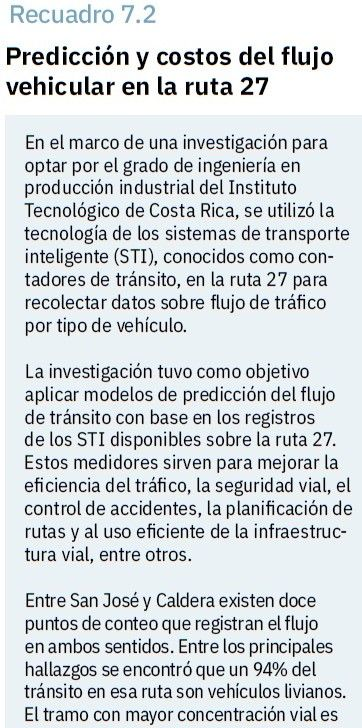
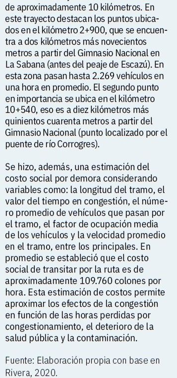

Hace exactamente un año estaba por realizar mi proyecto de graduación en el TEC, quería hacer algo diferente pero sobre todo quería que mi proyecto no quedara simplemente engavetado como un proyecto más.

Deseaba utilizar mi carrera para contruibuir de alguna manera al país-especialmente en materia de movilidad urbana. Hoy, puedo ver plasmado parte de mi trabajo en el Informe del Estado de la Nación 2020, lo cual me hace sentir orgullosa de las decisiones que tomé.

Como se mencionaba ayer en la presentación del Informe, la portada representa la esperanza. Que aunque ha sido un año duro siempre hay un faro de luz y un horizonte donde mirar para seguir adelante y no perderse en el camino.

No hay mejor forma de describir también mi trayectoria profesional y personal como esta portada.
¡Fue más que un proyecto!

Mi sección aparece en el Capítulo 7:
 “Patrones de la movillidad en tiempos de pandemia: una aproximación con técnicas del “big data”.
 
Si quieren ver el Informe completo lo pueden descargar [acá:](https://lnkd.in/ehVVSxf)

¡Gracias Dios, tuya es la gloria!

<left>

</left>

<right>

</right>